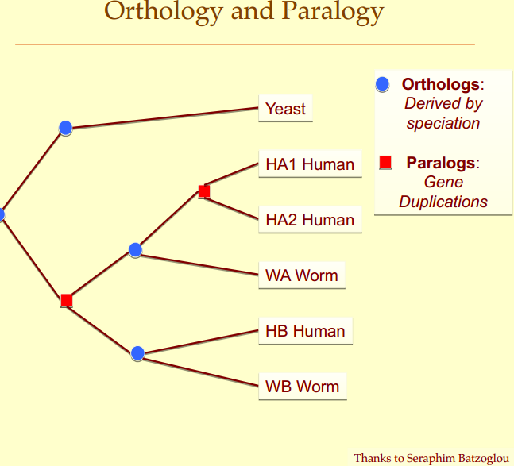
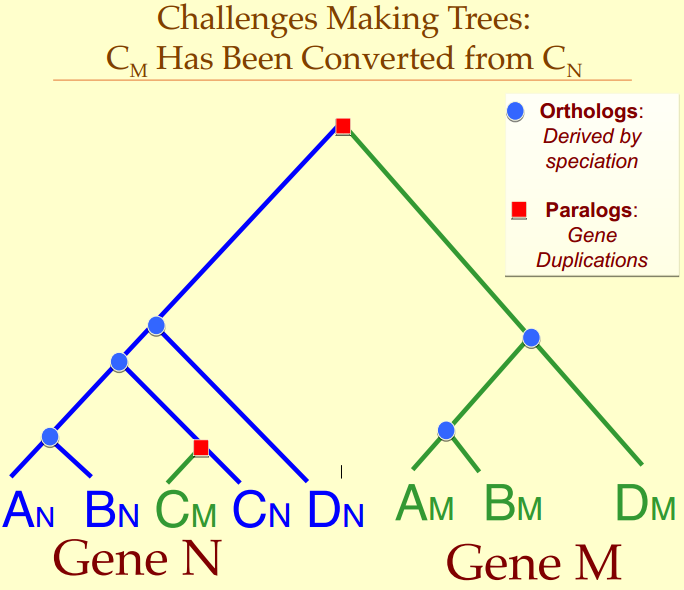

# Computational Phylogenetics-系统发生学

Representatino of Phylogenies:
Cladogram, dendrogram, phenogram, Curve-O-Gram, Eurogram, RadialGram

-------------
## Methods for Determining Phylogenies
### Parsimony-简约 (character based)
- Assigns mutations to Branches
- Minimize number of edits
- Topology maximinzes similarity of neighboring leaves
### Distance methods
+ Branch lengths=D(i,j)/2 for sequences i,j
+ Distances must be at least metric
+ Distances can reflect time or edits
+ Distance must be relatively contstant per unit branch length
### Probabilistic
+ Branch and Bound
+ Maximum likelihood

--------
## Properties of Trees

+ Rooted or Unrooted
+ Nodes and Branches
	- Internal Nodes
	- External Nodes - leaves(the exsited spcies)
+ One path/ pair(no ring)
+ Distancs

## Challenges Making Trees: (都在破壞樹的良好結構)
Chanllegens: Gene Duplication verus Speciation
Paralogous Evolution 平行同源進化, Orthologous Evolution 直系同源進化

Chanllegens: Gene Conversion

Horizontal Gene Transfer

## Additive Distance Tree

Three Leaf Tree

## Reading
http://biochem218.stanford.edu/
https://en.wikipedia.org/wiki/Population_genetics
