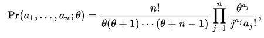

# 12. Evlution = Mutation + Selection

## 2. Hardy-Weinbegerg Law
Fleeming Jenkin(1867)
This model asssumes infinitte population size, completely random mating, and an
absence of selection, mutation, or migration. p*(1-p)

No selection in this case.

## 3. Neutral Theory of molecular evolution
1968: Most of mutations are neutral or nearly neutral, and the change of allelic
frequencies is a result of **random** genetic drift in **finite population**.
According to Kimura, the theory only applies only for evolution at the molecular
level, and natual selection controlls phenotypic evolution. In other words, the
selection intensity involved in the process is so weak that mutation pressure
and random drift prevail in molecular level.

    这就是之所以地理隔离能产生新表型？ 有限的群落～=空间决定基因的交流，资源限制种群大小，进而
    限制空间。分子进化就体现在基因在chromosome上的存在吗？

1972: Ewens Sampling Formula， posted _infinte alleles_ model. The infinte model
chaims that there are infinite number of states into which an allele can mutate,
so each mutation generates a unique allele.

>Ewens used the concept of identity by descent (IBD) as opposed to
identity by kind. IBD is a concept that is defined with respect to the allele in the
ancestor. Imagine that you and your sibling received the same copy of chr7 from
your mother. In this particular chromosome even if there is a mutation in one of
the genes, your copy and your siblings copy will be IBD but not identitical by kind.

> Ewens' sampling formula, introduced by Warren Ewens, states that under certain
conditions (specified below), if a random sample of n gametes is taken from a
population and classified according to the gene at a particular locus then the
probability that there are a1 alleles represented once in the sample, and a2
alleles represented twice, and so on, is

> for some positive number θ representing the population mutation rate,
## 4.1 Coalescent Theory(合祖理论)
backward in time, of a common ancestor between a pair of lineages that are both
ancestral to a present-day sample.
In the simplest case, coalescent theory assumes no recombination, no natural
selection, and no gene flow or population structure, meaning that each variant
is equally likely to have been passed from one generation to the next.

## 4.2 Rate-based selection metric (HOw to find the gene which is selected)
**Synonymous mutation(同义突变)** leaves the amino acid sequence intact, which a
**non-synonymous(非同义突变)** mutation change it. **Rate-based selection metric**
is defined by _dN/dS_, dN(rate of substitution of non-silent sites), calculated
by PAML.

If dN/dS<1, purifing selection, if dN/dS=1, neutral expectation; dN/dS>1, positive
selction.

## Parameters
Simple Size, gene nubmer, generation, selection model

## Reference
https://en.wikipedia.org/wiki/Coalescent_theory
